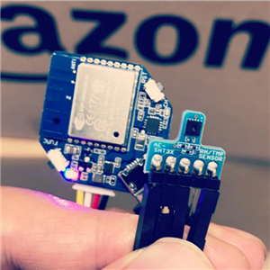

mqtt_sht31.ino
====
sample sketch for WioNode & SHT31.

- Akiduki SHT31 module
  - http://akizukidenshi.com/catalog/g/gK-12125/

- pubsubclient
  - https://github.com/knolleary/pubsubclient/

- Adafruit_SHT31
  - https://github.com/adafruit/Adafruit_SHT31

How to use:
----
     $ git clone https://github.com/yoggy/mqtt_sht31
     $ cd mqtt_sht31
     $ cp config.ino.sample config.ino
     $ vi config.ino
       - edit wifi_ssid, wifi_password, mqtt_server, mqtt_publish_topic, ... etc
     $ open mqtt_sht31.ino

Copyright and license
----
Copyright (c) 2017 yoggy

Released under the [MIT license](LICENSE.txt)